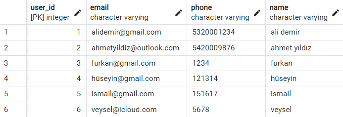
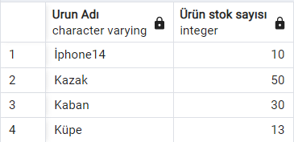

# EtiyaCamp

```sh
Select * from users
```


## Insert Into
```sh
INSERT INTO users ( email, phone, name) VALUES ( 'ismail@gmail.com', '151617', 'ismail');
INSERT INTO users ( email, phone, name) VALUES ( 'veysel@icloud.com', '5678', 'veysel');
```
#### Çıktısı:


## Join yapıları
---
##
### Inner Join
```sh
Select * from products p
inner join products_categories pc
on p.product_id=pc.product_id
inner join categories c
on pc.category_id=c.category_id
```
#### Çıktısı:

---
##
### Right Join
```sh
Select * from products p
right join products_categories pc
on p.product_id=pc.product_id
right join categories c
on pc.category_id=c.category_id
```
#### Çıktısı:

---
##
### Left Join
```sh
Select * from products p
left join products_categories pc
on p.product_id=pc.product_id
left join categories c
on pc.category_id=c.category_id
```
#### Çıktısı:

---
##
### Full Join
```sh
Select * from products p
full join products_categories pc
on p.product_id=pc.product_id
full join categories c
on pc.category_id=c.category_id
```
#### Çıktısı:

---
##
##
## Delete
```sh
DELETE from users
where user_id=7
```
#### Çıktısı:

---
##
##
## Update
```sh
UPDATE products set stock=5
where product_id=2
```
#### Çıktısı:

---
##
##
## Between
```sh
select p.name as "Ürün Adı", p.stock as "Ürün stok sayısı" from products p 
where p.stock
between 10 and 50
```
#### Çıktısı:

---
##
##
## In

```sh
select u.name, u.email,co.name,c.name from users u
inner join adresses a 
on u.user_id=a.user_id
inner join cities c
on a.city_id=c.city_id
inner join countries co 
on co.country_id=a.country_id
where c.name in ('ankara') and co.name in ('türkiye')
```
#### Çıktısı:

---
##
##
## Group By
```sh
Select c.name as "kategori adı",Sum(p.stock) as "kategorideki stok adedi" from products p
inner join products_categories pc
on p.product_id=pc.product_id
inner join categories c
on pc.category_id=c.category_id
group by c.name 
```
#### Çıktısı:

---
##
##


